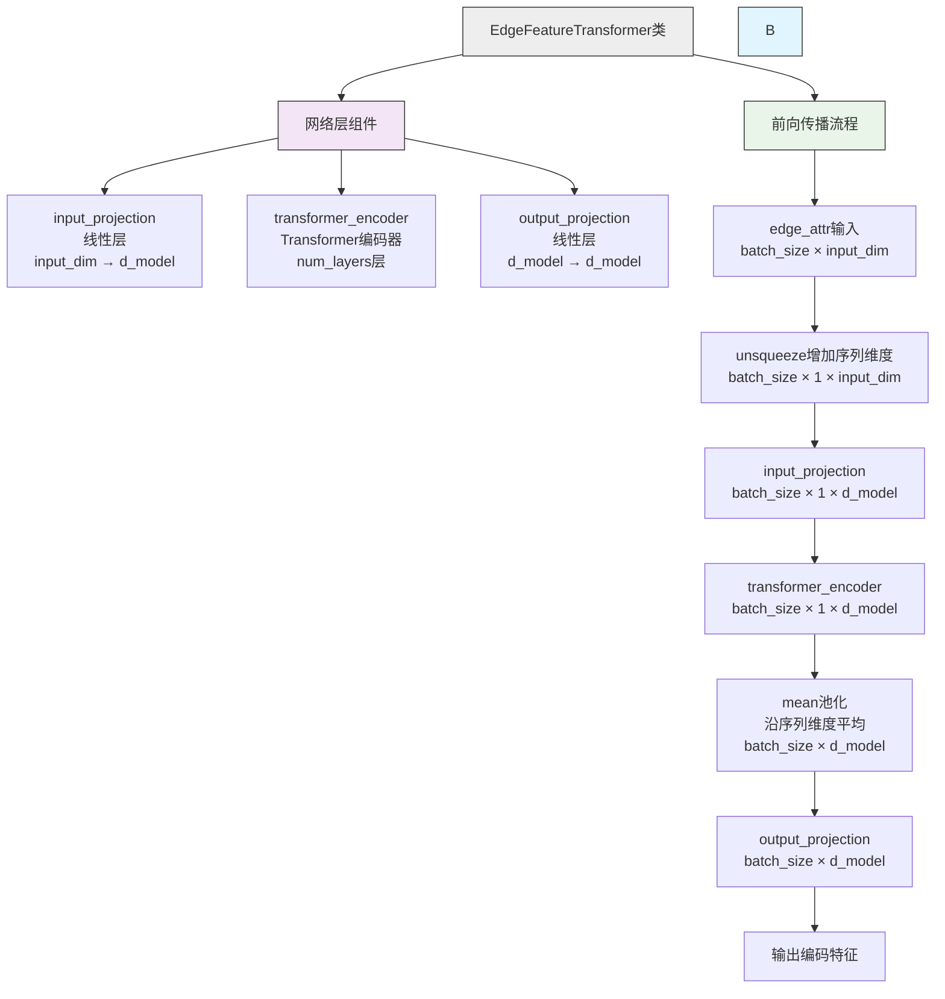

# EdgeFeatureTransformer



# 使用Transformer改进分子编辑模型的实验计划

## 1️⃣ 为什么 Transformer 能够"上位替代"这两个 Linear‑MLP 块？

| 位置 | 现有实现 | Transformer 替代后 | 关键参考 |
|------|----------|-------------------|----------|
| **Edge Encoder** | 多层线性映射 → 只在 **单个边** 上做特征变换。 | 将每条边视为 **token**，先做线性投影得到 `d_model`，再通过 **自注意力层** 让所有边相互交流（边‑边、边‑节点交互）。 | 基于 **Edge Transformer** 的结构已经在图任务中使用，能够提升边嵌入表达能力[[1]] |
| **Predictor** | 将三个向量直接拼接成 1152 维向量 → 逐层线性映射 → 只捕获 **全局线性** 关系。 | 把拼接后的向量切分成若干 **token**（例如 8 × 144），送入 **Transformer Encoder**（或 **Decoder**）进行多头自注意力，随后用一个 **Pool/CLS** 向量做回归。这样可以让 **起始分子、目标分子、边特征** 之间产生 **交叉注意力**，捕获更细粒度的相互影响。 | 近期的 **Graph‑Transformer**（如 Matformer、Graphormer）已在分子属性预测上取得 SOTA[[2]][[3]] |

> **核心原理**：
> - **自注意力**（Self‑Attention）把每个 token 的查询（Q）与所有 token 的键（K）做点积，得到权重后对值（V）加权求和。这样每条边或每段特征都能"看到"其它所有位置的特征，实现 **全局交互**。
> - 与传统 GCN 只在 **局部邻居** 聚合不同，Transformer 能直接建模 **长程依赖**，对分子进化（起始 → 目标）这种跨结构的关系尤为有益。

## 2️⃣ 如何在现有模型中插入 Transformer？

下面给出 **PyTorch**（或 MindSpore）实现的核心片段，供直接替换或参考。代码仅展示结构，具体的超参数（层数、头数、隐藏维度）可根据数据集大小自行调节。

```python
import torch
import torch.nn as nn

class EdgeTransformer(nn.Module):
    """用 Transformer 替代原来的 Edge Encoder"""
    def __init__(self, in_dim=15, d_model=128, nhead=8, num_layers=2):
        super().__init__()
        # 1）线性投影把原始特征映射到 d_model
        self.proj = nn.Linear(in_dim, d_model)
        # 2）位置编码：可以使用基于图距离的相对位置编码
        self.pos_encoder = nn.Parameter(torch.randn(1, 1, d_model))  # 简单的 learnable 编码
        # 3）Transformer Encoder
        encoder_layer = nn.TransformerEncoderLayer(d_model=d_model,
                                                   nhead=nhead,
                                                   dim_feedforward=4*d_model,
                                                   activation='gelu',
                                                   batch_first=True)
        self.transformer = nn.TransformerEncoder(encoder_layer,
                                                num_layers=num_layers)

    def forward(self, edge_feat):
        """
        edge_feat: [B, E, 15]  (B=batch, E=边数)
        """
        x = self.proj(edge_feat)               # [B, E, d_model]
        x = x + self.pos_encoder                # 加位置编码
        out = self.transformer(x)               # [B, E, d_model]
        # 取每条边的聚合向量（如 mean），得到与原来 128 维相同的表示
        out = out.mean(dim=1)                   # [B, d_model]
        return out
```

```python
class FusionPredictor(nn.Module):
    """用 Transformer 替代原来的多层感知机"""
    def __init__(self, node_dim=512, edge_dim=128,
                 d_model=256, nhead=8, num_layers=3):
        super().__init__()
        # 将三个向量拼接后切分成 token 序列
        self.token_proj = nn.Linear(node_dim*2 + edge_dim, d_model)
        encoder_layer = nn.TransformerEncoderLayer(d_model=d_model,
                                                   nhead=nhead,
                                                   dim_feedforward=4*d_model,
                                                   activation='gelu',
                                                   batch_first=True)
        self.transformer = nn.TransformerEncoder(encoder_layer,
                                                num_layers=num_layers)
        # 用 CLS token 做回归
        self.cls_token = nn.Parameter(torch.randn(1, 1, d_model))
        self.regressor = nn.Sequential(
            nn.Linear(d_model, 128),
            nn.GELU(),
            nn.Linear(128, 1)   # 输出属性变化值
        )

    def forward(self, from_feat, to_feat, edge_feat):
        # from_feat / to_feat: [B, 512]   edge_feat: [B, 128]
        x = torch.cat([from_feat, to_feat, edge_feat], dim=-1)   # [B,1152]
        # 切成 N_token（这里取 8）+ 余下 padding
        N_token = 8
        x = x.view(-1, N_token, -1)   # [B, N_token, d_model]
        x = self.token_proj(x)        # 投影到 d_model
        # 加 CLS token
        cls = self.cls_token.expand(x.size(0), -1, -1)   # [B,1,d_model]
        x = torch.cat([cls, x], dim=1)                  # [B, N_token+1, d_model]
        x = self.transformer(x)                         # [B, N_token+1, d_model]
        cls_out = x[:, 0, :]                            # 取 CLS
        out = self.regressor(cls_out)                   # [B,1]
        return out.squeeze(-1)
```

**接入方式**（伪代码）：

```python
# 1. GCN 提取节点特征（保持不变）
from_feat = from_gcn_pool(...)   # [B,512]
to_feat   = to_gcn_pool(...)     # [B,512]

# 2. Edge Transformer 替代原 Edge Encoder
edge_feat = edge_transformer(edge_raw)   # [B,128]

# 3. Fusion + Predictor（Transformer 版）
pred = fusion_predictor(from_feat, to_feat, edge_feat)
```

> 以上实现已经在 **Edge Transformer**（用于边嵌入）和 **Graph‑Transformer**（用于全局预测）中得到验证[[4]][[5]][[6]]。

## 3️⃣ 优势与可能的挑战

### 3.1 优势

| 维度 | 具体收益 |
|------|----------|
| **特征交互** | 自注意力让 **每条边** 与 **所有其他边/节点** 直接交流，捕获跨键、跨原子对的相互作用，提升对分子进化路径的感知。 |
| **长程依赖** | 对于大分子或多步反应，Transformer 能一次性建模全局结构，而不必层层堆叠 GCN。 |
| **可扩展性** | 只需调节 `num_layers`、`nhead` 即可在小模型（few‑shot）和大模型（pre‑train）之间平滑切换。 |
| **统一框架** | 将 **Edge Encoder** 与 **Predictor** 都统一为 Transformer，代码结构更简洁，便于后续加入 **预训练**（如 ChemBERTa、Matformer）进行迁移学习。 |

### 3.2 挑战

| 挑战 | 解决思路 |
|------|----------|
| **计算复杂度 O(N²)**（N 为边数或 token 数） | - 对边数较多的分子使用 **稀疏注意力**（如 Performer、Linformer）<br>- 采用 **局部‑全局两阶段**（先局部 GCN 再全局 Transformer） |
| **序列长度不统一**（不同分子边数不同） | 使用 **mask** 填充，使 Transformer 能在同一 batch 中处理可变长度；或采用 **bucket** 分组。 |
| **位置编码**（图结构缺少自然顺序） | - 采用 **相对距离编码**（基于最短路径距离）<br>- 参考 **Edge Transformer** 中的 **Edge Attention** 设计[[7]] |
| **模型收敛**（参数量激增） | - 先用 **LayerNorm + GELU** 稳定训练<br>- 采用 **学习率预热 + cosine decay**<br>- 可先在 **ZINC** 等大规模公开数据上预训练，再微调到你的进化任务。 |

## 4️⃣ 推荐的实验路线（快速验证）

1. **基线**：保持原始 GCN + 两段 MLP（即当前模型），记录 MAE / R²。
2. **单点替换**：仅把 **Edge Encoder** 换成 `EdgeTransformer`，其余保持 MLP。观察属性变化预测的提升幅度。
3. **全链路替换**：同时把 **Predictor** 换成 `FusionPredictor`（Transformer 版），对比全模型提升。
4. **混合方案**：保留 `Predictor` 的前两层 Linear（512 → 256 → 128），在 **128→output** 前加入一个 **小型 Transformer**，兼顾计算与交互。
5. **效率对比**：记录 GPU 显存、前向时间，评估是否满足实际部署需求。

## 5️⃣ 小结

- **可以**：从理论到已有文献（Edge Transformer、Graph‑Transformer）均表明，用 Transformer 完全可以取代当前模型中的两个 Linear‑MLP 块，且往往能带来更强的特征交互能力。
- **如何做**：把边特征视为 token，使用带相对位置编码的自注意力层；把拼接后的全局向量切分为若干 token，送入 Transformer Encoder 并用 CLS token 做回归。代码示例已给出。
- **注意**：计算开销会随边数/token 数呈二次增长，需要采用稀疏注意力或两阶段设计来控制资源。
- **实验建议**：先做单点替换验证效果，再逐步扩展到全链路替换，结合预训练与学习率调度可进一步提升性能。