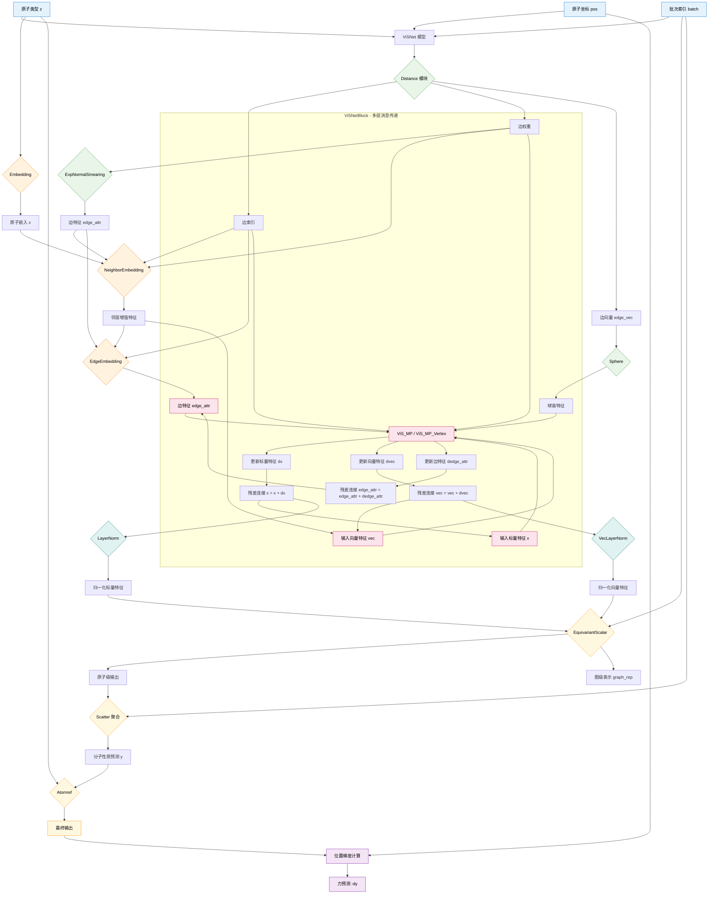
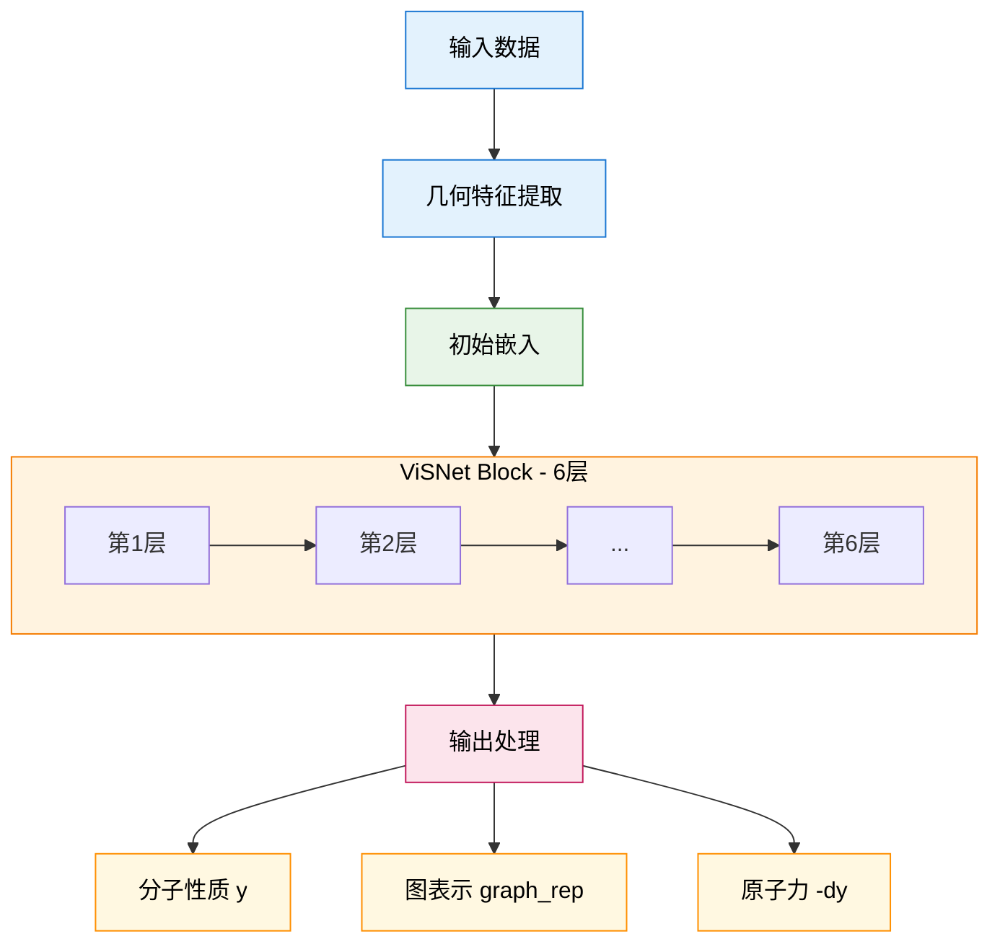

您说得对！我来重新绘制一个更适合显示的版本，避免使用深色背景：

## 🎨 颜色方案说明

现在使用了更浅的颜色方案，确保黑色文字清晰可读：

- **输入层**: 浅蓝色 `#e3f2fd`
- **预处理**: 浅绿色 `#e8f5e8` 
- **嵌入层**: 浅橙色 `#fff3e0`
- **消息传递**: 浅粉色 `#fce4ec`
- **归一化**: 浅青绿色 `#e0f2f1`
- **输出层**: 浅黄色 `#fff8e1`
- **导数计算**: 浅紫色 `#f3e5f5`

## 📊 数据流简化版本

如果您需要更简洁的版本，这里还有一个层次化的结构图：

这样的颜色方案既保持了模块的区分度，又确保了所有文字都清晰可读。您可以根据需要选择详细版本或简化版本。