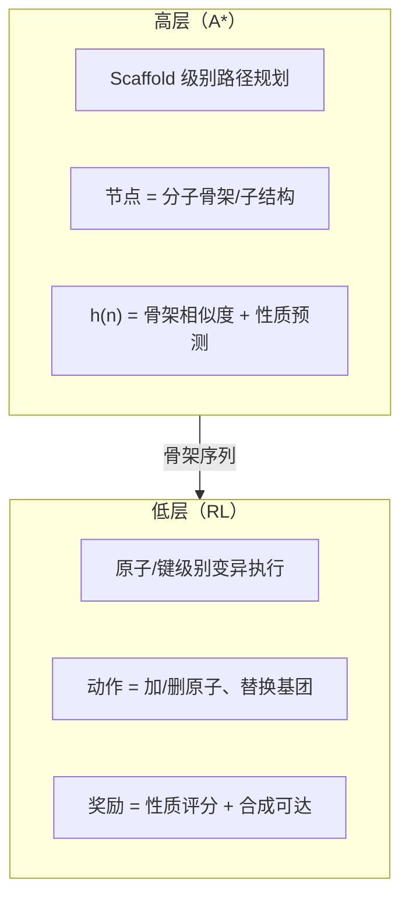

# A* 与 RL 结合用于分子进化空间搜索

分子进化空间有几个独特的挑战，让 A* 和 RL 各自单独使用都不够理想，但组合起来能互补。

## 分子进化空间的特殊性

| 挑战 | A* 的局限 | RL 的局限 |
| --- | --- | --- |
| 状态空间离散+巨大 | 需要好的启发 h(n) | 探索效率低，奖励稀疏 |
| 评估代价昂贵(DFT等) | 每步展开都要算 | 采样量大 |
| 目标模糊(多目标优化) | 难以定义 f(n) | 奖励函数设计难 |
| 局部最优陷阱多 | 贪心剪枝可能错过 | 容易过拟合局部区域 |

> **核心矛盾**：A* 需要一个好的启发函数，但分子性质很难手写规则；RL 有学习能力，但采样效率太低。

---

## 方案一：RL 训练启发函数，A* 负责搜索

> "RL 提供知识，A* 提供搜索保证"

### 训练阶段

```
分子图 → [RL Value Network V(s)] → 预测到达目标的代价
                                      ↓ 作为 h(n)
```

### 推理阶段

```
起始分子 ──A*──→ 最优变异路径
             g(n) = 已执行的变异步数
             h(n) = V(s)（RL 学到的价值估计）
             f(n) = g(n) + h(n)
```

**适合 mol-evo 的原因**：项目已有分子性质预测模型（surrogate），可以直接用它的隐层特征训练 V(s)，不需要从零开始。

---

## 方案二：A* 生成轨迹，RL 从中学习

> "A* 是老师，RL 是学生" — 类似 AlphaZero 的思路

```python
for episode in training:
    # A* 在小规模/低精度空间做规划，生成高质量路径
    path = astar(mol_start, mol_target, heuristic=surrogate_model)

    # 把这条路径作为 demonstration 训练 RL
    rl_agent.imitation_learn(path)        # 模仿学习 warm-up
    rl_agent.reinforce(path, rewards)     # 再用真实奖励微调

    # RL 的 value function 反过来更新 A* 的启发函数
    heuristic.update(rl_agent.value_net)
```

**关键优势**：A* 的最优路径避免了 RL 早期随机探索浪费的 DFT 计算 quota。

---

## 方案三：分层架构（最适合 mol-evo）

> "A* 规划骨架，RL 填充细节"



这与 mol-evo 中可能存在的 scaffold-based 进化天然契合。

---

## 对 mol-evo 项目的具体建议

### 概念接口设计

```python
class MolSearchNode:
    mol: Molecule
    g: float          # 变异步数 + 合成代价
    h: float          # surrogate_model.predict(mol) 的负值（越高越好）

    def expand(self) -> list[MolSearchNode]:
        # RL policy 给出候选变异，替代暴力枚举
        actions = rl_policy.top_k_actions(self.mol, k=20)
        return [apply_action(self.mol, a) for a in actions]

# A* 主循环不变，只是 expand() 由 RL 驱动
path = astar(
    start=seed_molecule,
    goal_fn=lambda m: property_score(m) > threshold,
    heuristic=lambda m: -value_network(m),   # RL 训练的 V(s)
    expand=rl_policy.propose_neighbors,       # RL 代替枚举
)
```

### 核心收益

- A* 保证不走回头路（closed set），避免重复 DFT 计算
- RL policy 把巨大的化学空间压缩到有意义的子集再搜索
- 启发函数可以用 mol-evo 现有的 surrogate model 直接插入，无需重新设计

---

## 方案对比

| 方案 | 实现难度 | 适合阶段 | 主要收益 |
| --- | --- | --- | --- |
| RL → A* 启发函数 | 低 | 有预训练模型时 | 利用现有 surrogate |
| A* → RL 轨迹 | 中 | 数据稀缺时 | 减少 DFT 调用 |
| 分层 A*+RL | 高 | 成熟系统 | 最强的探索效率 |

> 如果 mol-evo 里已经有 surrogate model 和 graph-based 变异操作，方案一几乎可以零改动地插入——把现有模型的输出当作 h(n) 传给 A*，立刻就能看到搜索效率的提升。
