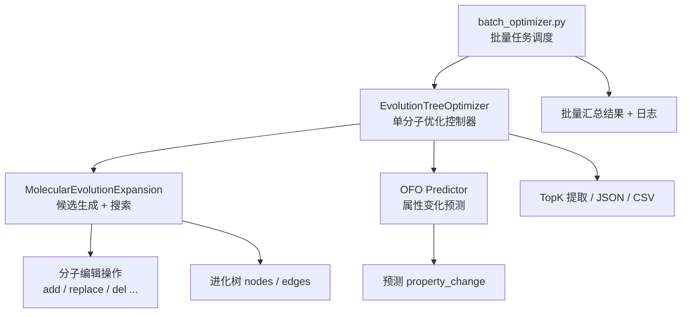

# `batch_optimizer.py` 框架总览

> 本文档面向后续接入的 Agent / 开发者，帮助快速理解 `mol_evo/scripts/batch_optimizer.py` 的职责边界、核心执行链路、关键依赖与输出产物。
>
> 如果把 `OFO-model-framework.md` 看作**模型能力说明书**，那么本文更偏向**任务编排与搜索执行说明书**。

---

## 1. 脚本定位

`batch_optimizer.py` 是一个**批量分子优化调度脚本**。

它的核心职责不是训练模型，也不是定义分子编辑算子，而是把这些能力串起来，完成下面这条链路：

1. 从 CSV 读取一批起始分子与其初始属性值
2. 为每个分子调用 `EvolutionTreeOptimizer`
3. 在内部执行 BFS / MCTS 搜索，生成候选分子进化树
4. 基于训练好的 OFO 属性变化预测模型为每条候选边打分
5. 产出每个分子的优化树 JSON、TopK CSV、批量汇总 JSON 和日志

它本质上是项目里的**数据集级 orchestration layer（编排层）**。

---

## 2. 解决什么问题

对于一个起始分子，项目并不是直接“回归出一个最优分子”，而是采用如下思路：

- 先枚举一系列允许的分子编辑操作（加原子、替换、删除等）
- 用 OFO 模型预测“从当前分子经过该操作后，目标属性会变化多少”
- 再用搜索策略（BFS / MCTS）决定保留哪些分支继续展开
- 最终得到一棵带预测属性值的进化树，并从中提取最优候选

因此，`batch_optimizer.py` 的实际作用可以概括为：

> **把单分子优化能力，提升为一批输入分子的自动化实验执行流程。**

---

## 3. 整体分层

### 3.1 各层职责

| 层级 | 位置 | 主要职责 |
|------|------|----------|
| 批量编排层 | `scripts/batch_optimizer.py` | 读数据、循环任务、记录日志、保存批量结果 |
| 单分子控制层 | `core/evolution_optimizer.py` | 加载模型、批量预测候选、触发 BFS/MCTS、保存树与 TopK |
| 搜索/扩展层 | `core/molecular_evolution_expansion.py` | 生成可执行操作、应用操作、校验分子、构建树 |
| 模型层 | `core/models/v0/...` | 预测一步操作带来的属性变化 |
| 特征/数据处理层 | `core/data/*`、`utils/predict/*` | 图构建、操作特征编码、属性统计加载 |

---

## 4. 主执行链路

## 4.1 批量入口：`main()`

`batch_optimizer.py` 的 `main()` 完成以下工作：

1. 解析 CLI 参数
2. 创建输出目录
3. 写入主日志 `batch_optimization_main.log`
4. 从输入 CSV 读取 `smiles + target_property`
5. 调用 `batch_process()` 逐个分子执行优化
6. 保存总结果 `batch_results.json`
7. 统计成功/失败数量与耗时

### 4.2 数据读入：`read_csv_data()`

输入 CSV 至少假定有：

- `smiles`
- 与 `--target-property` 同名的属性列，例如 `lumo`

每一行会被转换为：

- `smiles`
- `property_value`
- `original_row`

其中 `original_row` 会完整保留原始行，后续写入总结果 JSON。

### 4.3 批量调度：`batch_process()`

这是脚本最关键的批量控制函数：

- 整批任务只初始化**一个** `EvolutionTreeOptimizer`
- 对每个分子：
  - 设置 `optimizer.initial_property_value`
  - 调用 `run_evolution_optimizer()`
  - 将结果写入 `results_dict`
  - 追加写入总日志
- 每处理 5 个分子，或处理结束时，落盘一次 `batch_results.json`

这说明脚本的资源复用策略是：

> **模型只加载一次，单分子初始属性值逐条注入。**

### 4.4 单分子执行：`run_evolution_optimizer()`

单个分子的处理顺序是：

1. 记录运行开始时间
2. 将当前分子的初始属性值注入 `optimizer.initial_property_value`
3. 调用 `optimizer.optimize_evolution_tree(...)`
4. 保存该分子的进化树 JSON
5. 提取 TopK 候选并写出 CSV
6. 回读 JSON 组成返回结构

返回结构大致包含：

- `status`
- `smiles`
- `initial_property`  
- `optimized_result` 
- `topk_results`
- `runtime`

---

## 5. `EvolutionTreeOptimizer` 在做什么

`core/evolution_optimizer.py` 是单分子优化的核心控制器。

### 5.1 初始化阶段

实例化时主要做三件事：

1. 加载训练好的 OFO 模型权重
2. 加载属性统计量（用于预测值反标准化）
3. 加载操作配置与原子/操作类型定义

同时会初始化：

- `self.molecule_cache = MoleculeCache("prediction_dataset")`
- `self.property_stats`
- `self.target_property`
- `self.optimization_mode`

其中 `MoleculeCache` 的作用是减少重复 SMILES 到图数据的转换开销。

### 5.2 预测接口：`predict_batch()`

这是搜索层最依赖的能力。

输入：

- `from_smiles_list`
- `to_smiles_list`
- `operation_details_list`

内部会：

1. 将 `from/to` 分子转为图结构
2. 根据操作详情构造边特征 `edge_attr`
3. 用 `torch_geometric.data.Batch` 做批量拼接
4. 调用模型预测一步 `property_change`
5. 如果训练时使用过标准化，则在这里**反标准化**

因此，下游搜索看到的分数，已经是**原始尺度上的属性变化量**，不是标准化值。

### 5.3 优化入口：`optimize_evolution_tree()`

这个方法做的是“把搜索器和预测器接起来”：

- 构造 `MolecularEvolutionExpansion(initial_smiles, config_file=...)`
- 根据 `search_mode` 选择：
  - `generate_expansion_tree()`：BFS
  - `generate_expansion_tree_mcts()`：MCTS
- 传入预测器本身 `predictor=self`
- 传入方向、深度、分支、剪枝与 logP 约束
- 返回统一格式的 `evolution_tree`

也就是说：

> **搜索层不直接懂模型，只依赖预测器接口；优化器层负责把模型封装成可搜索的 evaluator。**

---

## 6. 搜索层怎么工作

## 6.1 BFS 模式：`generate_expansion_tree()`

BFS 版不是“每个父节点局部选几个”这么简单，而是：

1. 按层遍历当前 frontier
2. 对每个节点生成全部合法操作
3. 对所有候选边做**批量预测**
4. 把当前层所有候选汇总到 `all_candidates`
5. 按优化方向统一排序
6. 取当前层前 50%（至少 1 个，最多 500 个）进入下一层
7. 生成新的 `nodes / edges`

这意味着它更接近：

> **“逐层展开 + 全局层内排序截断”的 beam-like 搜索**，而不是朴素 BFS。

### BFS 中的约束与剪枝

BFS 模式下有两类重要剪枝：

- **属性改善停滞剪枝**：
  - 如果沿当前路径连续若干层没有朝目标方向改善，剪掉该分支
- **logP 范围剪枝**：
  - 如果路径上连续若干层 `logP` 超出设定范围，剪掉该分支

同时还会维护 `seen_molecules`，避免重复 SMILES 反复加入树中。

## 6.2 MCTS 模式：`generate_expansion_tree_mcts()`

MCTS 版的特点：

- 使用 PUCT 公式选择子节点
- 首次展开时，仍然通过 `predictor.predict_batch()` 对候选操作批量打分
- 只保留按预测值排序后的 `top max_branching` 个候选
- 用 softmax 将候选预测值转成 `prior`
- 叶节点价值函数直接使用 `accumulated_change`
- 最终把内部 MCTS 树再转换成与 BFS 兼容的 `nodes / edges` 结构

MCTS 输出会额外带上：

- `search_mode = "mcts"`
- `mcts_stats`
- 每个节点的 `mcts_visits / mcts_prior / mcts_q_value`

这保证了：

> **无论 BFS 还是 MCTS，下游保存 JSON、打印树、提取 TopK 的逻辑都能复用。**

---

## 7. 树结构与分数字段

优化结果本质上是一棵 `evolution_tree`，核心字段包括：

- `initial_smiles`
- `max_depth`
- `max_branching`
- `nodes`
- `edges`
- `statistics`（由 `save_optimized_tree()` 补充）

### 7.1 常见节点字段

BFS / MCTS 共用的核心字段通常有：

- `id`
- `smiles`
- `depth`
- `parent_id`
- `operation`
- `details`
- `logP`
- `logP_in_range`
- `property_change`
- `accumulated_change`
- `property_value`

### 7.2 分数语义

需要区分三个概念：

- `property_change`：当前这一步操作带来的预测变化量
- `accumulated_change`：从根节点累计到当前节点的总变化量
- `property_value`：当前节点的预测属性值，通常为
  - `parent.property_value + property_change`

因此，搜索实际上是在**局部一步预测**的基础上，逐层累积出整条路径的估计属性值。

---

## 8. 输出产物

默认输出目录由 `create_output_dir()` 生成：

- `$(cwd)/mol_evo/output/evo-mo/batch_optimization_<timestamp>/`

在该目录下通常会看到：

### 8.1 批量级文件

- `batch_optimization_main.log`
  - 记录本次批量运行的参数配置与最终统计
- `batch_optimization_total.log`
  - 记录逐分子的处理进度、状态与耗时
- `batch_results.json`
  - 整批汇总结果

### 8.2 单分子级文件

每个分子会额外生成：

- `<smiles前缀>_<runid>.json`
  - 该分子的完整优化树
- `<smiles前缀>_<runid>_topK.csv`
  - TopK 结果表

### 8.3 TopK CSV 格式

`save_topK_results_to_csv()` 输出的是**单行宽表**，字段类似：

- `mol_start`
- `value_start`
- `mol_1`, `value_1`
- `mol_2`, `value_2`
- ...

适合快速浏览或导入表格工具，不适合存复杂树结构。

---

## 9. 关键参数怎么理解

## 9.1 搜索控制

- `--max-depth`
  - 树最大深度
- `--max-branching`
  - 每层/每节点最多保留的候选规模
- `--search-mode`
  - `bfs` 或 `mcts`
- `--num-simulations`
  - MCTS 模拟次数
- `--exploration-weight`
  - MCTS PUCT 探索强度

## 9.2 优化目标相关

- `--target-property`
  - 当前批量任务要优化的目标属性名，如 `lumo`
- `--direction`
  - `increase` 表示越大越好，`decrease` 表示越小越好
- `--optimization-mode`
  - `sub` / `pct`，决定变化值的解释方式

## 9.3 化学约束相关

- `--pruning-patience`
  - 连续多少层没有改善就停止该分支
- `--logp-min` / `--logp-max`
  - 允许的 `logP` 范围
- `--logp-patience`
  - 连续多少层 `logP` 越界后剪枝

## 9.4 数据切片相关

- `--start-index`
- `--end-index`

用于对输入 CSV 做切片，方便分批实验或断点式手动续跑。

---

## 10. 与 `OFO-model-framework.md` 的关系

两份文档的关注点不同：

- `OFO-model-framework.md`
  - 说明**模型本身怎么构成**：分子特征提取器、边特征提取器、融合预测器
- 本文
  - 说明**模型如何被用于搜索与批量实验**：数据读入、搜索展开、打分、剪枝、落盘

可以简单理解为：

- `OFO-model-framework.md` 回答：**模型是什么**
- `batch-optimizer-framework.md` 回答：**模型如何参与实际优化任务**

---

## 11. Agent 需要特别注意的实现细节

下面这些点对后续做改造、排障或自动化实验很重要：

### 11.1 默认路径是硬编码的

`--model-path`、`--model-dir`、`--config-file` 默认值明显指向开发者历史环境，不适合直接跨机器复用。

对于 Agent 来说，这意味着：

- **不要盲信默认值可运行**
- 真正执行前应优先检查模型文件和配置文件是否存在

### 11.2 输出目录依赖当前工作目录

`create_output_dir()` 使用的是 `os.getcwd()`，不是脚本绝对路径。

这意味着：

- 若从项目根目录执行，输出通常正常
- 若从其他目录执行，结果目录可能落在意料之外的位置

### 11.3 `--batch-size` 参数当前没有真正接到批量预测

`batch_optimizer.py` 里暴露了 `--batch-size`，但当前主链路并没有把它传入 `EvolutionTreeOptimizer.predict_batch()`。

因此它更像一个**预留参数**，而不是当前生效的性能调节项。

### 11.4 信号处理中断目前并不完整

脚本注册了 `SIGINT` 处理器，并维护了全局 `interrupted` 标志；但当前批量主流程没有显式把该标志同步到 `optimizer.interrupted`，也没有在 `batch_process()` 中主动中止循环。

因此：

- 从代码结构看，作者想做“优雅中断”
- 但在当前实现里，这个能力**没有完全打通**

### 11.5 单分子异常会中断整个批处理

`run_evolution_optimizer()` 的异常分支里先 `raise e`，后面的 `return {'status': 'error', ...}` 实际上不可达。

这会导致：

- 一旦某个分子出错
- 批量任务大概率直接终止
- 而不是像接口表面暗示的那样，把该分子标为 `error` 后继续下一个

这是当前最值得注意的稳定性问题之一。

### 11.6 `results_dict` 用 `smiles` 作为 key

批量结果字典是：

- `results_dict[smiles] = ...`

如果输入 CSV 中存在重复 `smiles`，前一条结果会被后一条覆盖。

### 11.7 `get_topK_results()` 的实现实际上会遍历所有非根节点

注释写的是“收集叶节点”，但实现里只排除了根节点，并没有真的判断叶节点。

这意味着 TopK 当前语义更接近：

> **在整棵树的所有非根节点中按预测属性值排序取前 K**

而不是“只在最后一层叶子里取前 K”。

---

## 12. 对后续 Agent 的阅读建议

如果后续需要继续改造该系统，推荐按下面顺序阅读：

1. `scripts/batch_optimizer.py`
   - 看清批量任务入口与输出物
2. `core/evolution_optimizer.py`
   - 看清模型加载、预测、TopK 与单分子控制逻辑
3. `core/molecular_evolution_expansion.py`
   - 看清候选生成、BFS/MCTS 搜索与剪枝细节
4. `docs/core/OFO-model-framework.md`
   - 看清底层预测模型结构
5. `tests/evo-algorithm/tests/test_mcts_search_mode.py`
   - 看清 MCTS 的兼容性约束与预期行为

---

## 13. 一句话总结

`batch_optimizer.py` 可以被看作项目里的**批量实验控制台**：它以 `EvolutionTreeOptimizer` 为核心，把**分子编辑生成器**、**OFO 属性变化预测器**和**BFS/MCTS 搜索策略**组织成一条可批量执行、可落盘、可排序筛选的分子优化流水线。
