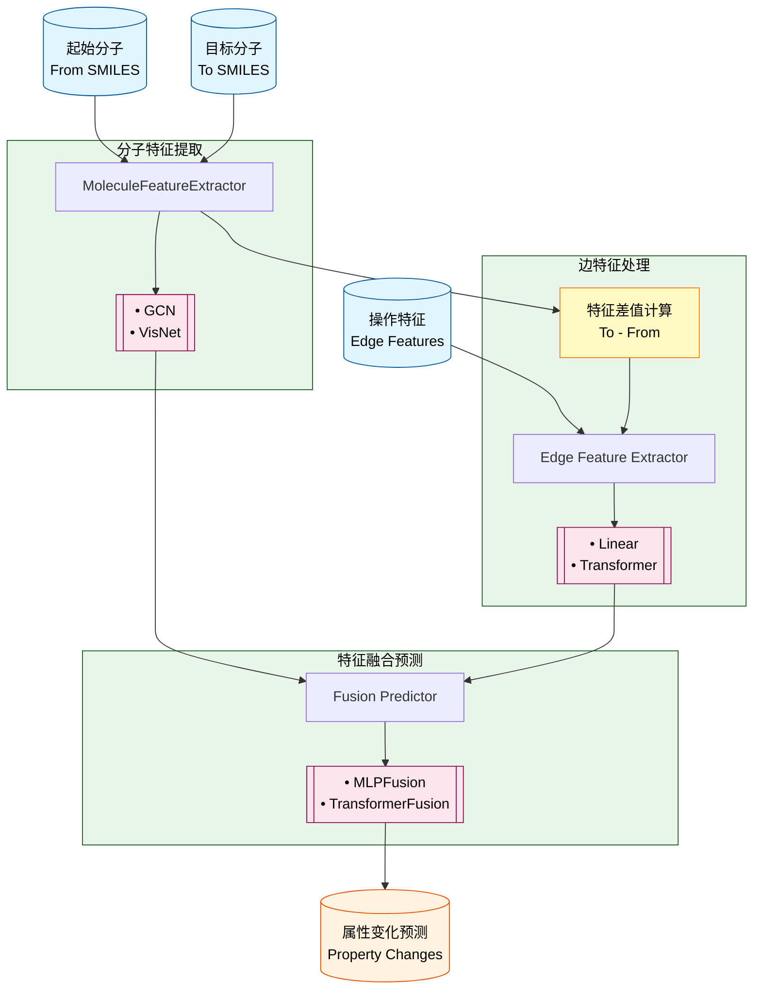

根据您的需求，我修改了流程图，在 edge feature 处理中加入 to-smile 特征减去 from-smile 特征的操作：

## 修改说明

主要修改点：

1. **在边特征处理模块中新增了"特征差值计算"组件**：
   - 接收来自分子特征提取器的 to-smile 和 from-smile 特征
   - 计算 `to-smile特征 - from-smile特征` 的差值

2. **调整了数据流向**：
   - 分子特征提取器现在同时输出到融合预测器和特征差值计算器
   - 特征差值计算结果作为边特征处理模块的额外输入

3. **边特征处理模块的输入现在包括**：
   - 原始的 edge 特征
   - to-smile 特征减去 from-smile 特征的差值

这样的设计能够更好地捕捉分子转化过程中的结构变化信息，为边特征提供更丰富的上下文信息。