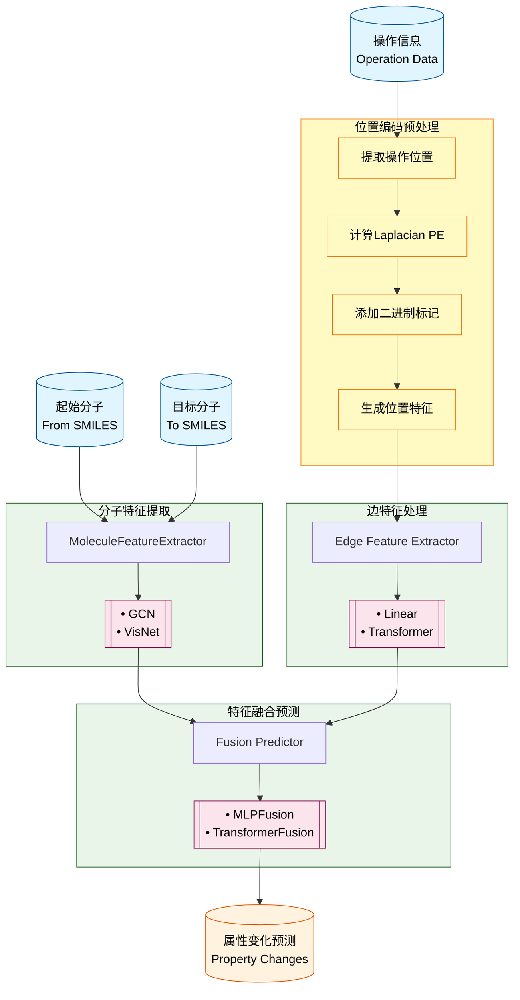
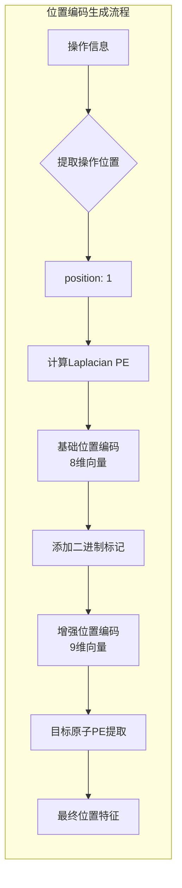
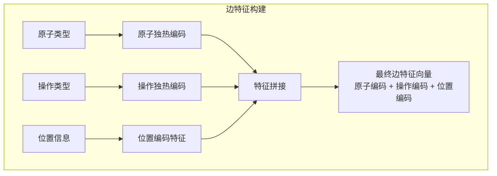

基于方案一集成位置编码后的模型框架如下：



## 详细数据流说明

### 位置编码预处理流程



### 边特征构建流程



## 特征维度变化

### 原始边特征维度
```
原子类型编码: len(atom_types) 维
操作类型编码: len(operation_types) 维
总维度: len(atom_types) + len(operation_types)
```

### 增强边特征维度（方案一）
```
原子类型编码: len(atom_types) 维
操作类型编码: len(operation_types) 维
位置编码特征: pe_dim + 1 维（基础PE + 二进制标记）
总维度: len(atom_types) + len(operation_types) + (pe_dim + 1)
```

### 示例计算
假设：
- 原子类型数量：10
- 操作类型数量：5  
- 位置编码维度：8

则：
- **原始边特征维度**：10 + 5 = 15维
- **增强边特征维度**：10 + 5 + (8 + 1) = 24维

## 模型组件调整

### Edge Feature Extractor 需要调整输入维度

**LinearEdgeFeatureExtractor**:
```python
# 修改前
edge_feature_dim = 15  # 原子编码(10) + 操作编码(5)

# 修改后  
edge_feature_dim = 24  # 原子编码(10) + 操作编码(5) + 位置编码(9)
```

**TransformerEdgeFeatureExtractor**:
```python
# 修改前
input_dim = 15

# 修改后
input_dim = 24
```

## 数据预处理流程更新

```python
# 修改前的调用
edge_feat = prepare_edge_features(row, property_stats, include_property_changes=False)

# 修改后的调用
edge_feat = prepare_edge_features_with_position(
    row, 
    property_stats, 
    include_property_changes=False,
    include_position_encoding=True,  # 新增参数
    pe_dim=8                         # 新增参数
)
```

## 优势说明

1. **位置感知**：模型能够明确知道操作发生在分子的哪个具体位置
2. **结构感知**：Laplacian PE 编码了原子在分子全局结构中的位置信息
3. **向后兼容**：通过 `include_position_encoding` 参数控制，不影响现有代码
4. **模块化设计**：位置编码作为预处理步骤，不改变核心模型架构

这个框架保持了原有的模块化设计，同时通过新增的位置编码预处理模块，显著增强了模型对操作位置的理解能力。