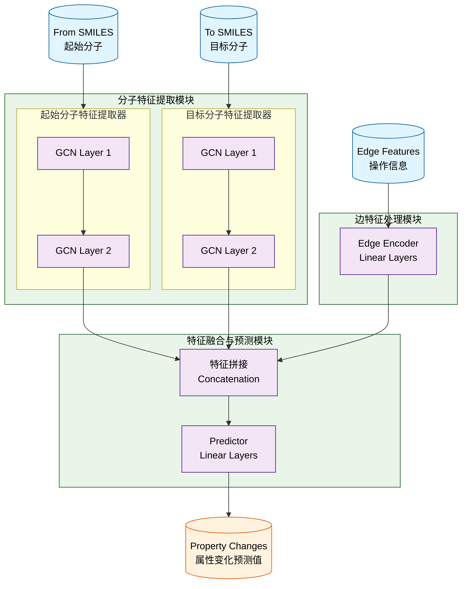

# Molecular Evolution Prediction Model v0 - Flowchart

## 流程图说明

该流程图展示了基于GCN的分子进化预测模型v0版本的整体架构和数据流向：

1. **输入层**：
   - 起始分子（From SMILES）
   - 目标分子（To SMILES）
   - 操作信息（Edge Features）

2. **分子特征提取模块**：
   - 使用两个独立的GCN网络分别处理起始分子和目标分子
   - 每个GCN网络包含两层GCN层

3. **边特征处理模块**：
   - 使用线性网络对操作信息进行编码

4. **特征融合与预测模块**：
   - 将起始分子特征、目标分子特征和边特征进行拼接
   - 通过线性层预测属性变化

5. **输出层**：
   - 输出预测的属性变化值