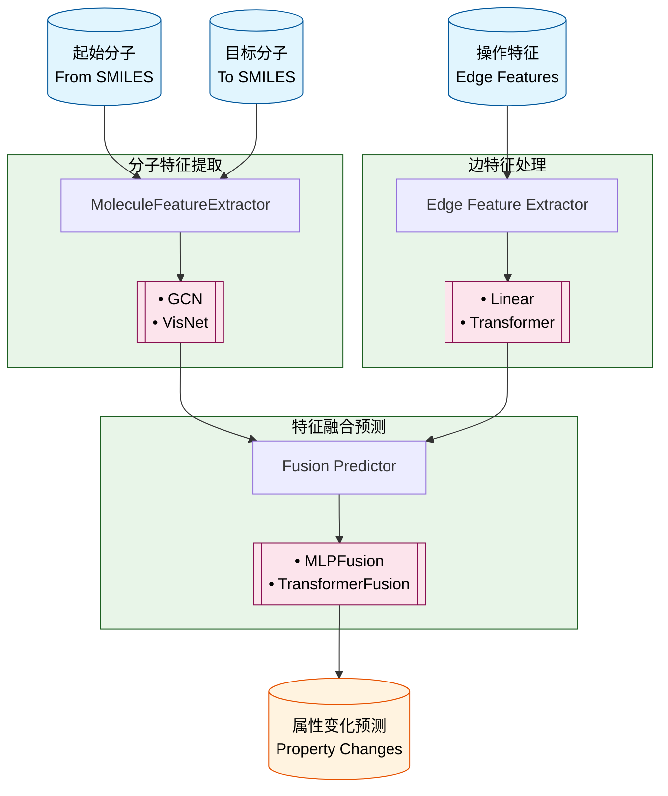
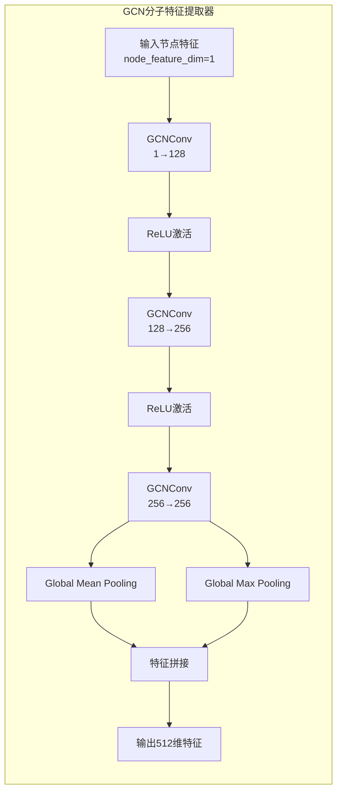

# Molecular Evolution Prediction Model v0 - Flowchart

## 流程图说明

该流程图展示了基于 GCN 的分子进化预测模型 v0 版本的整体架构和数据流向：

1. **输入层**：

   - 起始分子（From SMILES）
   - 目标分子（To SMILES）
   - 操作信息（Edge Features）

2. **主要处理模块**：

   - 分子特征提取模块：使用 GCN 网络从分子图中提取特征表示
   - 边特征处理模块：对边特征（操作信息）进行编码，支持线性和 Transformer 两种方式
   - 特征融合与预测模块：融合分子特征和边特征，预测属性变化，支持 MLP 和 Transformer 两种方式

3. **输出层**：
   - 输出预测的属性变化值

## 模型组件架构

模型采用模块化设计，目前包含以下组件类型：

### 1. Molecule Feature Extractor（分子特征提取器）

功能：使用 GCN 网络从分子图中提取特征表示

实现类：[GCNMoleculeFeatureExtractor](file:///home/rhj/projects/mol_opt/mol-ofo/mol_evo/core/models/v0/molecule_feature_extractors/gcn.py#L18-L74)

详细结构：

- 采用 3 层 GCNConv 结构：1→128→256→256
- 前两层后使用 ReLU 激活函数
- 最后一层不使用激活函数
- 使用 Global Mean Pooling 和 Global Max Pooling 进行图池化
- 将两个池化结果拼接得到最终的 512 维特征向量

### 2. Edge Feature Extractor（边特征提取器）

实现类：

- [LinearEdgeFeatureExtractor](file:///home/rhj/projects/mol_opt/mol-ofo/mol_evo/core/models/v0/edge_feature_extractors/linear.py#L15-L48)
- [TransformerEdgeFeatureExtractor](file:///home/rhj/projects/mol_opt/mol-ofo/mol_evo/core/models/v0/edge_feature_extractors/transformer.py#L16-L82)

功能：对边特征（操作信息）进行编码

#### LinearEdgeFeatureExtractor

功能：使用线性层对边特征进行编码

结构：

- 输入层：将边特征从原始维度映射到 64 维
- 隐藏层 1：ReLU 激活后映射到 128 维
- 隐藏层 2：ReLU 激活后映射到目标维度(hidden_dim)

详细参数：

- edge_feature_dim: 边特征维度，默认为 11
- hidden_dim: 隐藏层维度，默认为 128

#### TransformerEdgeFeatureExtractor

功能：使用 Transformer 架构对边特征进行编码，替代原有的线性层

结构：

- 输入投影层：将输入维度映射到 d_model
- Transformer 编码器层：包含多头注意力机制和前馈网络
- 全局平均池化：将序列维度合并
- 输出投影层：将 d_model 映射到目标维度

详细参数：

- input_dim: 输入特征维度，默认为 11
- d_model: Transformer 模型维度，默认为 128
- nhead: 注意力头数，默认为 8
- num_layers: Transformer 层数，默认为 2
- dim_feedforward: 前馈网络维度，默认为 512
- dropout: Dropout 概率，默认为 0.1

### 3. Fusion Predictor（特征融合预测器）

实现类：

- [MLPFusionPredictor](file:///home/rhj/projects/mol_opt/mol-ofo/mol_evo/core/models/v0/fusion_predictors/mlp.py#L15-L69)
- [TransformerFusionPredictor](file:///home/rhj/projects/mol_opt/mol-ofo/mol_evo/core/models/v0/fusion_predictors/transformer.py#L16-L103)

功能：融合分子特征和边特征，预测属性变化

#### MLPFusionPredictor

功能：使用 MLP 对起始分子、目标分子和边特征进行融合，通过全连接层逐步降维，最后输出预测结果

结构：

- 特征拼接：将起始分子、目标分子和边特征拼接在一起
- 多层感知机：多个线性层和 ReLU 激活函数交替组成
- 输出层：将特征映射到输出维度

详细参数：

- node_dim: 节点特征维度，默认为 512（来自 GCN 提取器的输出）
- edge_dim: 边特征维度，默认为 256
- hidden_dims: 隐藏层维度列表，默认为[512, 256, 128]
- output_dim: 输出维度，默认为 15

#### TransformerFusionPredictor

功能：使用 Transformer 架构对起始分子、目标分子和边特征进行融合，通过自注意力机制实现全局特征交互，最后用 CLS token 做回归预测

结构：

- 特征投影：将拼接后的特征投影到 d_model 维度
- Transformer 编码器：多层 Transformer 编码器实现特征交互
- CLS Token：用于最终预测的分类标记
- 回归预测器：通过 MLP 实现最终的属性变化预测

详细参数：

- node_dim: 节点特征维度，默认为 512（来自 GCN 提取器的输出）
- edge_dim: 边特征维度，默认为 128
- d_model: Transformer 模型维度，默认为 256
- nhead: 注意力头数，默认为 8
- num_layers: Transformer 层数，默认为 3
- output_dim: 输出维度，默认为 15

## 当前可用模型

基于以上组件，目前实现了以下两种模型：

1. **gcn_linear_linear**：

   - 分子特征提取器：GCNMoleculeFeatureExtractor
   - 边特征提取器：LinearEdgeFeatureExtractor
   - 特征融合预测器：MLPFusionPredictor

2. **gcn_transformer_transformer**：
   - 分子特征提取器：GCNMoleculeFeatureExtractor
   - 边特征提取器：TransformerEdgeFeatureExtractor
   - 特征融合预测器：TransformerFusionPredictor
