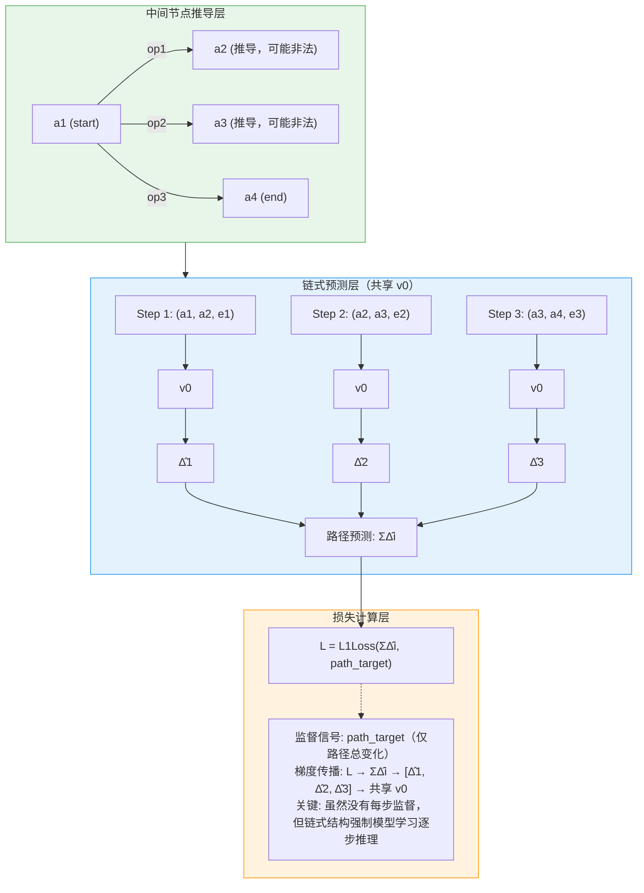
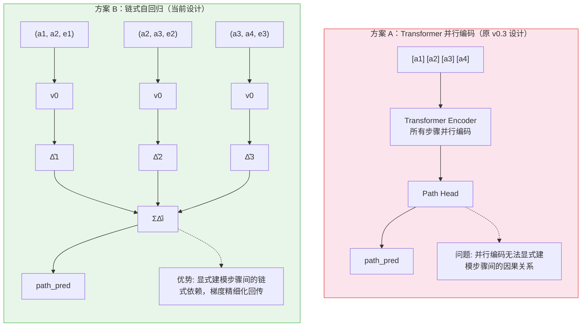
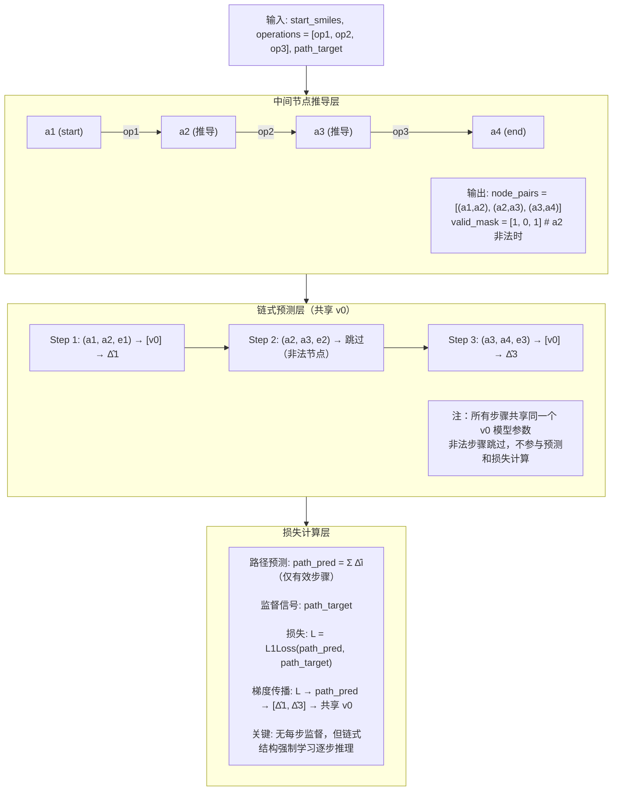

# v0.3 链式自回归路径模型

## 概述

v0.3 采用**链式自回归（滑动窗口迭代）架构**，在共享 v0 基础模型上，逐步预测属性变化 Δ，实现路径级别的累积预测。

### 数据条件

**已知信息**：
- `start_smiles`, `end_smiles`：起始和终止分子
- `operations`：操作序列
- `path_target`：路径总属性变化

**未知信息**：
- 中间节点 SMILES（需从 operations 推导，可能生成非法 SMILES）
- 每步属性变化（黑箱，无监督信号）

### 训练策略

由于只有**路径总监督信号**，采用**端到端链式预测**：
1. 从 `start_smiles` 逐步应用 `operations` 推导中间节点
2. 链式迭代预测每步变化 Δ̂i
3. 累积得到路径总预测 ΣΔ̂i
4. 损失只在路径级别计算，梯度通过链式结构反向传播

### 与 v0 的关键区别

| 维度 | v0 (单步) | v0.3 (链式自回归) |
|------|-----------|-------------------|
| 样本格式 | `(from, to, edge)` pair | `(start, operations, end)` path |
| 模型架构 | 独立预测单步变化 | 共享 v0，链式迭代预测 |
| 训练策略 | 单步监督 | 端到端路径监督 |
| 监督信号 | 单步属性变化 | 仅路径总变化 |
| 梯度传播 | 单步反向传播 | 路径损失 → 链式回传 |
| 中间节点 | 直接输入 | 从 operations 推导 |

---

## 核心设计思想

### 架构流程

> 输入: `start_smiles`, `operations = [op1, op2, op3]`, `path_target`



### 与 Transformer 并行方案对比



---

## 路径样本格式 (JSON)

```json
{
    "path_id": "path_001",
    "start_smiles": "CCO",
    "end_smiles": "CCNCC",
    "operations": [
        {"atom": "N", "operation": "replace_atom", "position": "2"},
        {"atom": "C", "operation": "add_atom", "position": "2"},
        {"atom": "C", "operation": "add_atom", "position": "3"}
    ],
    "target_property": "lumo_change",
    "path_target": -0.35
}
```

### 字段说明

| 字段 | 必填 | 说明 |
|------|------|------|
| `start_smiles` | ✅ | 起始分子 SMILES |
| `end_smiles` | ✅ | 终止分子 SMILES |
| `operations` | ✅ | 操作序列，长度 = 路径步数 T |
| `path_target` | ✅ | 路径总属性变化（唯一监督信号） |
| `target_property` | ❌ | 目标属性名称 |

### 数据预处理

中间节点在训练时动态推导：

```python
def derive_intermediate_nodes(start_smiles: str, operations: List[dict]) -> List[str]:
    """
    从 start_smiles 逐步应用 operations，推导中间节点
    
    Returns:
        node_smiles_list: [start, mid1, mid2, ..., end]
        其中部分中间节点可能是非法 SMILES（用 None 或占位符表示）
    """
    nodes = [start_smiles]
    current = start_smiles
    
    for op in operations:
        current = apply_operation(current, op)
        nodes.append(current)
    
    return nodes  # 长度 = T + 1
```

---

## 模型架构

### 核心类设计

```python
class VisNetChainPathV03(nn.Module):
    """链式自回归路径模型 - 端到端路径监督"""
    
    def __init__(self, v0_config: dict):
        super().__init__()
        # 共享 v0 基础模型
        self.v0 = MoleculeEvolutionVisnetLinearPredictor(**v0_config)
        # 非法节点占位特征
        self.invalid_node_embedding = nn.Parameter(torch.randn(512))
        
    def forward(
        self,
        node_pairs: List[Tuple[Data, Data]],  # [(a1, a2), (a2, a3), (a3, a4)]
        edge_features: torch.Tensor,           # (B, T, 15)
        valid_mask: torch.Tensor,              # (B, T) 每步是否有效
        path_target: torch.Tensor = None       # (B, 1)
    ) -> Dict:
        """
        端到端链式预测
        
        Args:
            node_pairs: 从 operations 推导的节点对
            edge_features: 操作特征
            valid_mask: 步骤有效性掩码（中间节点非法时为 0）
            path_target: 路径总属性变化（唯一监督信号）
        """
        B, T = edge_features.shape[:2]
        step_preds = []
        
        # 链式迭代预测
        for t in range(T):
            from_data, to_data = node_pairs[t]
            edge_t = edge_features[:, t, :]
            
            # 跳过无效步骤
            if not valid_mask[:, t].all():
                step_preds.append(torch.zeros(B, 1, device=edge_t.device))
                continue
            
            # v0 预测单步变化
            delta_t = self.v0(from_data, to_data, edge_t)
            step_preds.append(delta_t)
        
        # 聚合
        step_preds = torch.cat(step_preds, dim=1)  # (B, T)
        path_pred = step_preds.sum(dim=1, keepdim=True)  # (B, 1)
        
        output = {
            "step_preds": step_preds,
            "path_pred": path_pred
        }
        
        # 路径级监督损失
        if path_target is not None:
            output["loss"] = F.l1_loss(path_pred, path_target)
        
        return output
```

### 架构图



### 参数量估算

| 组件 | 参数 |
|------|------|
| 共享 v0 模型 | ~2.5M |
| **总计** | **~2.5M** |

相比 Transformer 并行方案（~2.6M），参数量相近，但模型结构更简洁。

---

## 损失函数

```python
# 仅路径级监督
L = L1Loss(path_pred, path_target)

# 其中 path_pred = Σ Δ̂i (仅有效步骤)
```

### 损失设计说明

| 特性 | 说明 |
|------|------|
| **单一监督信号** | 只有路径总变化作为监督 |
| **链式梯度传播** | 损失通过链式结构反向传播到每一步 |
| **隐式步骤学习** | 模型被迫学习每步合理的 Δ 分布 |
| **非法步骤处理** | 无效步骤不参与累积，直接跳过 |

---

## 非法节点处理

### 规则

1. **首尾节点非法** → 直接丢弃整条样本
2. **中间节点非法** → 该步骤跳过，不参与损失计算

### 实现示例

```python
# 节点合法性: [✓, ✓, ✗, ✓]
# 有效步骤: [step_0, step_2]
# 跳过: step_1（涉及非法节点 a3）

valid_mask = torch.tensor([1, 0, 1])  # 步骤有效性掩码
step_loss = (step_loss * valid_mask).sum() / valid_mask.sum()
```

---

## 训练配置

```bash
python mol_evo/train_v0_3_chain.py \
    -d mol_evo/dataset/data/paths.json \
    -p lumo_change \
    -e 200 \
    -b 32 \
    --path-loss-weight 0.5
```

### 关键超参

| 参数 | 默认值 | 说明 |
|------|--------|------|
| `path_loss_weight` | 0.5 | 路径总损失权重（λ） |
| `max_path_length` | 20 | 最大路径步数 |
| `learning_rate` | 1e-4 | 学习率 |

---

## 推理模式

### 给定路径评估（v0.3 主任务）

```python
def evaluate_path(
    self,
    start_smiles: str,
    operations: List[dict]
) -> float:
    """
    给定路径，评估总属性变化
    
    Args:
        start_smiles: 起始分子
        operations: 操作序列
    
    Returns:
        total_delta: 预测的路径总属性变化
    """
    # 推导中间节点
    nodes = derive_intermediate_nodes(start_smiles, operations)
    
    # 链式预测
    total_delta = 0
    for i in range(len(operations)):
        from_data = encode_molecule(nodes[i])
        to_data = encode_molecule(nodes[i + 1])
        edge = encode_operation(operations[i])
        
        delta = self.v0(from_data, to_data, edge)
        total_delta += delta
    
    return total_delta
```

### 批量路径比较

```python
def rank_paths(
    self,
    start_smiles: str,
    candidate_paths: List[List[dict]]
) -> List[Tuple[float, List[dict]]]:
    """
    对多条候选路径排序
    
    Args:
        start_smiles: 起始分子
        candidate_paths: 多条操作序列
    
    Returns:
        ranked: [(predicted_delta, operations), ...]
    """
    results = []
    for ops in candidate_paths:
        delta = self.evaluate_path(start_smiles, ops)
        results.append((delta, ops))
    
    return sorted(results, key=lambda x: x[0])
```

---

## 输出目录结构

```
mol_evo/output/v0_3/visnet_chain_v0_3/train-{timestamp}-{property}/
├── last.pth                 # 模型权重
├── model_config.json        # 模型与训练配置
├── training_process.json    # 训练过程记录
└── training.log             # 训练日志
```

---

## 优势总结

| 特性 | 说明 |
|------|------|
| **链式显式建模** | 每步预测显式可解释，非黑箱并行 |
| **参数共享** | 所有步骤共享 v0，参数效率高 |
| **梯度精细化** | 路径损失通过链式结构精细化回传到每步 |
| **非法节点容错** | 动态推导时自动处理非法中间节点 |
| **路径评估友好** | 直接输出每步预测，便于分析和调试 |

---

## 后续扩展方向

1. **路径搜索**: 结合分子生成器做 beam search
2. **多属性联合训练**: 扩展为多任务预测
3. **课程学习**: 从短路径逐步扩展到长路径
4. **强化学习**: 引入中间奖励信号

---

## 潜在问题与解决

### 问题1：无每步监督，如何学习合理分布？

**分析**：模型可能学会将所有变化集中在某一步

**解决**：
- 正则化：添加每步预测的平滑约束
- 课程学习：从短路径（1-2步）开始训练
- 预训练：用 v0 的单步数据预训练共享参数

### 问题2：非法中间节点如何处理？

**方案**：
1. **跳过**：非法步骤不参与预测和损失计算
2. **占位特征**：使用可学习的 `invalid_node_embedding`
3. **首尾约束**：首尾节点非法时丢弃整条样本

### 问题3：长路径梯度消失？

**解决**：
- 梯度裁剪
- 路径长度限制（max_path_length=10）
- 残差连接（可选增强）
