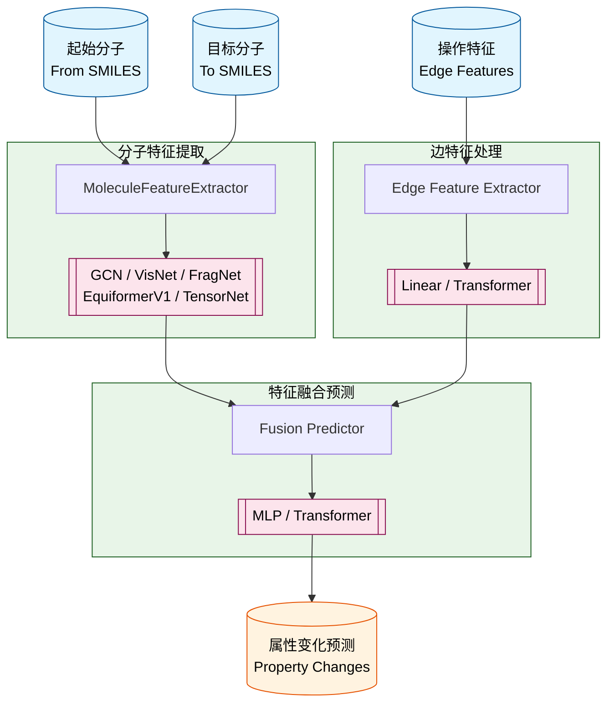

# Model v0 设计文档

## 概述

Model v0 是分子进化预测系统的基础模型，目标是根据**起始分子**、**目标分子**和**操作信息**，预测分子演化过程中的属性变化（如 QM9 数据集中的 15 个量子化学属性）。

核心设计思想：**三组件模块化架构** —— 将模型解耦为分子特征提取、边特征编码和特征融合预测三个独立模块，支持灵活组合。

---

## 整体架构



### 数据流

```
[from_data, to_data] → MoleculeFeatureExtractor × 2 → [from_feat, to_feat]
[edge_attr]           → EdgeFeatureExtractor          → [edge_feat]
[from_feat, to_feat, edge_feat] → FusionPredictor → property_changes
```

### 统一 Forward 接口

所有 v0 模型共享统一的调用签名：

```python
def forward(self, from_data: Data, to_data: Data, edge_attr: torch.Tensor) -> torch.Tensor
```

---

## 组件 A：分子特征提取器（MoleculeFeatureExtractor）

将分子图数据转换为固定维度的特征向量。每个模型包含两个独立实例，分别处理起始分子和目标分子。

| 提取器 | 类名 | 输出维度 | 特点 |
|--------|------|----------|------|
| GCN | `GCNMoleculeFeatureExtractor` | 512 (mean+max) | 3层 GCNConv + 双池化拼接 |
| VisNet | `VisNetMoleculeFeatureExtractor` | 512 (cat) | 等变向量-标量交互消息传递 |
| FragNet | `FragNetMoleculeFeatureExtractor` | 256 (mean+max) | Fragment + GAT |
| EquiformerV1 | `EquiformerV1MoleculeFeatureExtractor` | 512 (mean+max) | 等变 Transformer |
| TensorNet | `TensorNetMoleculeFeatureExtractor` | 512 | 张量网络等变模型 |

### A.1 GCN 分子特征提取器

```
(data.x, data.edge_index) → GCNConv(node_dim→128) → ReLU
→ GCNConv(128→256) → ReLU
→ GCNConv(256→256)
→ global_mean_pool + global_max_pool → cat → 512 维
```

### A.2 VisNet 分子特征提取器

基于论文 *"Enhancing Geometric Representations for Molecules with Equivariant Vector-Scalar Interactive Message Passing"* (arXiv:2210.16518)。

核心内部链路：

```
(z, pos, batch) → ViSNet.forward()
  ├─ ViSNetBlock (6层)
  │   ├─ Embedding(max_z, 128) — 原子嵌入
  │   ├─ Distance(cutoff=5.0) — 基于 radius_graph 的距离计算
  │   ├─ Sphere(lmax=1) — 球谐函数 (输出3维)
  │   ├─ ExpNormalSmearing(cutoff=5.0, num_rbf=32) — 指数正态展径向基函数
  │   ├─ NeighborEmbedding — 邻域嵌入 (MessagePassing, aggr='add')
  │   ├─ EdgeEmbedding — 边嵌入 (x_i + x_j) * edge_proj(edge_attr)
  │   ├─ ViS_MP × 6层 — 等变向量-标量交互消息传递 (Q/K/V 多头注意力)
  │   └─ VecLayerNorm — 向量层归一化 (max-min)
  ├─ EquivariantScalar
  │   ├─ GatedEquivariantBlock × 2 (128→64→1)
  │   └─ scatter_mean → 64维 graph_rep
  └─ Atomref — 原子参考值先验
→ FC(64→128) + ReLU → FC(128→256)
→ cat([x, x]) → 512 维
```

**关键设计**：graph_rep 已是图级别表示（通过 scatter_mean 聚合），最终通过双重复制模拟 mean+max 双通道设计。

---

## 组件 B：边特征提取器（EdgeFeatureExtractor）

将操作信息（原子类型、操作类型等）编码为固定维度特征。

### B.1 LinearEdgeFeatureExtractor

```
edge_feature_dim → Linear→64 → ReLU → Linear→128 → ReLU → Linear→hidden_dim
```

默认维度：11 → 64 → 128 → 128

### B.2 TransformerEdgeFeatureExtractor

```
edge_feature_dim → Linear→64 → ReLU → Linear→128 → ReLU → Linear→d_model
→ TransformerEncoder(num_layers=2, d_model=128, nhead=8, dim_feedforward=512)
→ squeeze → d_model 维
```

### B.3 TransformerEdgeFeatureExtractorLap

支持可选位置编码（LAP）的变体。当 `pe_dim > 0` 时，将基础特征投影与位置编码投影拼接后送入 Transformer（d_model 变为 2x），最终通过输出投影映射回 d_model。

---

## 组件 C：特征融合预测器（FusionPredictor）

融合起始分子特征、目标分子特征和边特征，输出属性变化预测值。

### C.1 MLPFusionPredictor

```
cat([from_feat, to_feat, edge_feat]) → total_input_dim
→ Linear→512 → ReLU → Linear→256 → ReLU → Linear→128 → ReLU → Linear→output_dim
```

### C.2 TransformerFusionPredictor

```
cat([from_feat, to_feat, edge_feat]) → total_input_dim
→ Linear→512 → ReLU → Linear→d_model
→ TransformerEncoder(num_layers=3, d_model=256, nhead=8, dim_feedforward=1024)
→ Linear→128 → ReLU → Linear→output_dim
```

---

## 模型注册与工厂

### 注册系统

通过 `@register_model` 装饰器自动注册模型，支持元数据配置：

```python
@register_model(
    display_name="VisNet Linear-Linear 模型",
    save_dir_name="visnet_linear_linear",
    requires_position_encoding=False
)
class MoleculeEvolutionVisnetLinearPredictor(nn.Module): ...
```

### 工厂模式

```python
# 创建模型
model = ModelFactory.create("visnet_linear_linear", **kwargs)

# 列出可用模型
ModelFactory.list_models()
```

---

## 已注册模型一览

| 注册名 | 显示名 | 分子提取器 | 边提取器 | 融合预测器 |
|--------|--------|-----------|---------|-----------|
| `gcn_linear_linear` | GCN Linear-Linear | GCN | Linear | MLP |
| `gcn_transformer_linear` | GCN-Transformer-Linear | GCN | Transformer | MLP |
| `gcn_transformer_transformer` | GCN-Transformer-Transformer | GCN | Transformer | Transformer |
| `visnet_linear_linear` | VisNet Linear-Linear | VisNet | Linear | MLP |
| `visnet_transformer_linear` | ViSNet-Transformer-Linear | VisNet | Transformer | MLP |
| `frag_linear_linear` | FragNet Linear-Linear | FragNet | Linear | MLP |
| `equiformer_linear_linear` | Equiformer Linear-Linear | EquiformerV1 | Linear | MLP |
| `tensornet_linear_linear` | TensorNet Linear-Linear | TensorNet | Linear | MLP |

---

## 关键维度总结

| 维度 | GCN | VisNet | FragNet | EquiformerV1 | TensorNet |
|------|-----|--------|---------|-------------|-----------|
| 分子提取器输出 | 512 | 512 | 256 | 512 | 512 |
| 默认边特征维度 | 11 | 15 | 16 | 11 | 15 |
| 边编码器输出 | 256 | 256 | 128 | 256 | 512 |
| MLP 输入维度 | 768 | 768 | 384 | 768 | 1536 |
| MLP 隐藏层 | 512→256→128 | 512→256→128 | 512→256→128 | 512→256→128 | 512→256→128 |

---

## 代码结构

```
core/models/v0/
├── __init__.py                          # 注册系统 + 工厂模式 + 基类
├── molecule_feature_extractors/         # 分子特征提取器子包
│   ├── gcn.py                           #   GCNMoleculeFeatureExtractor
│   ├── visnet.py                        #   VisNetMoleculeFeatureExtractor (+ ViSNet 完整实现)
│   ├── fragnet.py                       #   FragNetMoleculeFeatureExtractor
│   ├── equiformer_v1.py                 #   EquiformerV1MoleculeFeatureExtractor
│   └── tensornet.py                     #   TensorNetMoleculeFeatureExtractor
├── edge_feature_extractors/             # 边特征提取器子包
│   ├── linear.py                        #   LinearEdgeFeatureExtractor
│   ├── transformer.py                   #   TransformerEdgeFeatureExtractor
│   └── transformer_lap.py              #   TransformerEdgeFeatureExtractorLap
├── fusion_predictors/                   # 特征融合预测器子包
│   ├── mlp.py                           #   MLPFusionPredictor
│   └── transformer.py                   #   TransformerFusionPredictor
├── gcn_linear_linear.py                 # GCN + Linear + MLP
├── gcn_transformer_linear.py            # GCN + Transformer + MLP
├── gcn_transformer_transformer.py       # GCN + Transformer + Transformer
├── visnet_linear_linear.py              # VisNet + Linear + MLP
├── visnet_transformer_linear.py         # VisNet + Transformer + MLP
├── frag_linear_linear.py                # FragNet + Linear + MLP
├── equiformer_linear_linear.py          # EquiformerV1 + Linear + MLP
└── tensornet_linear_linear.py           # TensorNet + Linear + MLP
```

---

## 输入输出

**输入**:
- `from_data`: 起始分子图数据 (`torch_geometric.data.Data`)，包含节点特征 `x`、边索引 `edge_index`、原子序数 `z`、坐标 `pos`、批次 `batch`
- `to_data`: 目标分子图数据（同上结构）
- `edge_attr`: 操作特征张量 `(batch_size, edge_feature_dim)`

**输出**:
- 属性变化预测值 `(batch_size, output_dim)`

---

## 特殊设计说明

### FragNet 列表模式

`frag_linear_linear` 模型额外支持**列表形式输入**的逐样本处理（用于 one-by-one 训练场景），当 `from_data` 和 `to_data` 为列表时，逐个提取特征并合并结果。

### v0.1 特征差值设计（提案）

v0.1 版本提案中设计了**特征差值计算**组件：将分子特征提取器的 to-smile 特征减去 from-smile 特征，作为边特征处理模块的额外输入，以更好捕捉分子转化过程中的结构变化信息。

### v0.3 链式自回归扩展

v0.3 在共享 v0 基础模型上，采用链式自回归（滑动窗口迭代）架构，逐步预测属性变化，实现路径级别的累积预测。详见 [model-v0.3/model.md](./model-v0.3/model.md)。
